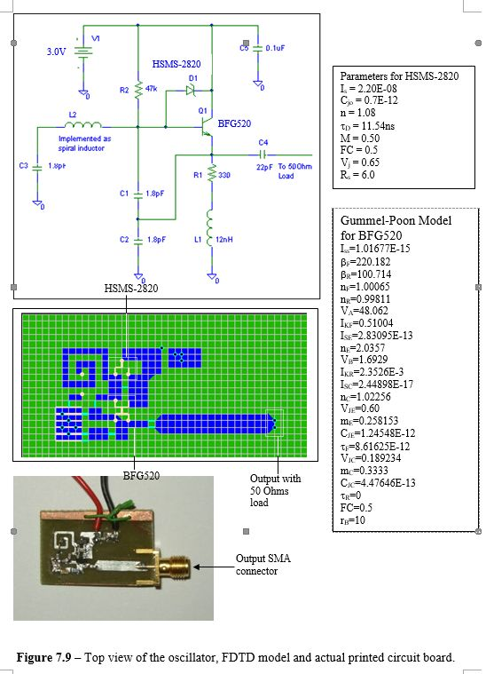
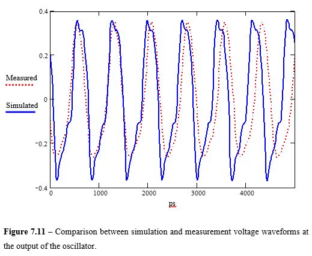

# 3D_FDTD_Codes_Electromagnetic_Wave
This is a standard FDTD codes for solving 3D full-wave Maxwell's Equations, using cubes as the volume element.
The codes uploaded here is only the FDTD computation engine, without the user interface to read in the input
files and the user interface to display the output. Originally the user interface is created in Visual Basic,
but nowadays it should be pretty fast to create this using Qt and python.

The project actually completed way back in 2003 and a bit out-dated with todays more advanced implementation.
The codes are made open source with GPL 3.0 license and largely forgotten.   
For the theory behind the codes and full implementation with a graphical user interface, the input file syntax 
and output format, please see this article
and the references within:
https://www.jpier.org/pier/pier.php?paper=0407141

